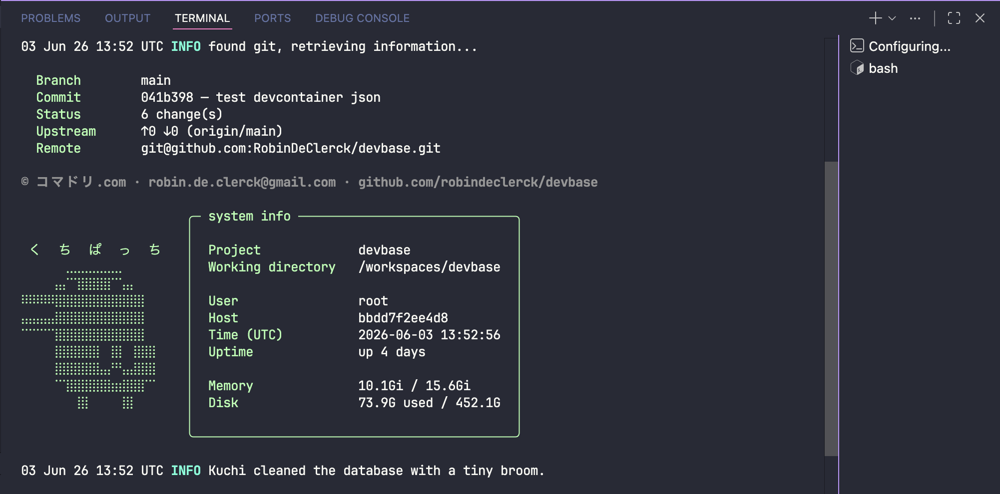

# Devcontainer - devbase

> _"It works on my machine."_ — Famous last words, before dev containers.

[](https://github.com/komadori-dev/devbase/actions/workflows/publish.yml) [](https://github.com/komadori-dev/devbase/actions/workflows/test-devcontainer.yml) [](https://github.com/komadori-dev/devbase/actions/workflows/test-terminal.yml)

A shared Alpine-based dev container image with a terminal banner, [Starship](https://starship.rs) prompt, and language presets that auto-install dependencies on attach.



## Command-line

Scaffold a new project's `.devcontainer/` interactively:

```bash
bash -c "$(curl -fsSL "https://raw.githubusercontent.com/komadori-dev/devbase/main/templates/init.sh?$(date +%s)")"
```

Walks you through name, slug, and preset, then drops `.devcontainer/devcontainer.json`, `Dockerfile`, `docker-compose.override.yml`, and `docker-compose.yml` into the current directory.

Requires [`gum`](https://github.com/charmbracelet/gum) — the script will offer to install it via Homebrew if missing.

## How To Use It

In any project's `.devcontainer/devcontainer.json`:

```jsonc
{
  "image": "ghcr.io/komadori-dev/devbase:latest",
  "containerEnv": { "DEVBASE_PRESETS": "python" },
  "postAttachCommand": "bash -lc terminal"
}
```

Need extra tools? Extend it with a project-local Dockerfile:

```dockerfile
FROM ghcr.io/komadori-dev/devbase:latest
RUN apk add --no-cache python3 py3-pip && \
    rm -f /usr/lib/python*/EXTERNALLY-MANAGED
```

## Folder Structure

```
your-project/
  .devcontainer/
    devcontainer.json
    Dockerfile
    docker-compose.override.yml
    pre-attach/
      01-secrets.sh
      02-env.sh
    post-attach/
      01-migrate.sh
  docker-compose.yml
```

## Presets

`DEVBASE_PRESETS` is comma-separated. Each preset runs on attach.

| Preset   | What it does                                                                 |
| -------- | ---------------------------------------------------------------------------- |
| `python` | Installs `requirements-dev.txt` if present, else `requirements.txt`.         |
| `node`   | Runs `npm ci` if `package-lock.json` exists, else `npm install`.             |

If a preset's runtime is missing, you get a hint pointing at the Dockerfile line you need.

## Hooks

Run your own scripts before or after presets by dropping executable `.sh` files into `.devcontainer/pre-attach/` or `.devcontainer/post-attach/`. They're discovered automatically — no config needed.

Scripts run in lexicographic order. Use numeric prefixes (`01-`, `02-`) to control sequencing — zero-pad them so `09` sorts before `10`.

Only files with the executable bit set are run. Non-executable files are silently skipped, so you can safely keep a `README.md` or a disabled script in the folder without side effects.

```bash
chmod +x .devcontainer/pre-attach/01-secrets.sh
```

On attach you'll see:

```
DEBUG  discovered [2] pre-attach script(s)
DEBUG  discovered [1] post-attach script(s)
```

If a script exits non-zero, the run aborts immediately and logs an error — subsequent scripts in the same phase are skipped.

## What's in the image

- `bash`, `gum`, `starship`, `figlet`, `lolcat`
- `openssh-client`, `ca-certificates`
- `terminal` — banner + system info + git info + daily tip on shell start

## Testing

The test suite runs automatically on every push and pull request via GitHub Actions.

| Workflow | What it tests |
| -------- | ------------- |
| `test-terminal` | Unit tests for the terminal lib (`hooks.sh`, `preset.sh`, `git.sh`) using [bats](https://github.com/bats-core/bats-core) |
| `test-devcontainer` | Integration tests that spin up the real devcontainer for both the `node` and `python` presets and assert the full attach flow |

To run the unit tests locally:

```bash
sudo apt-get install -y bats   # or: brew install bats-core
bats tests/terminal/
```

## Develop

See [docs/TAG.MD](docs/TAG.MD) for tagging and publishing a release.

## License

MIT — © Robin De Clerck
